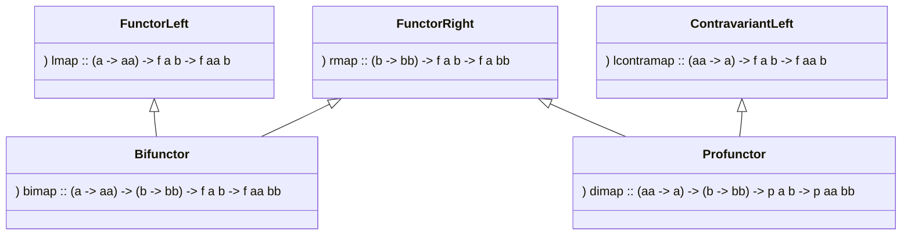

[](https://github.com/lemastero/trifunctors/actions?query=workflow%3A%22Haskell+CI%22+branch%3Amaster)

# Trifunctors

## Data.UnifyBifunctorProfunctor



Explore encoding of Bifunctor and Profunctor

```Haskell
class (FunctorLeft f, FunctorRight f) => Bifunctor f where
  bimap :: (a -> aa) -> (b -> bb) -> f a b -> f aa bb
  bimap f g = lmap f . rmap g

class (ContravariantLeft p, FunctorRight p) => Profunctor p where
  dimap :: (aa -> a) -> (b -> bb) -> p a b -> p aa bb
  dimap f g = lcontramap f . rmap g
```

using 3 typeclass'es:

```Haskell
class FunctorRight f where
  rmap :: (b -> bb) -> f a b -> f a bb

class FunctorLeft f where
  lmap :: (a -> aa) -> f a b -> f aa b

class ContravariantLeft f where
  lcontramap :: (aa -> a) -> f a b -> f aa b
```

that is more modular:
- reveal that rmap in Profunctor and Bifunctor is the same thing
- split laws into into each typeclass

## Data.Zifunctor

Push this idea to types with 3 type arguments. This leads to Zifunctor abstraction
that can be used to describe calculations that can fail with aa or succeed with rr
and require input of type e.

```Haskell
class (FunctorLeft f, FunctorRight f, ContravariantRight f) => Zifunctor f where
  zimap :: (ee -> e) -> (a -> aa) -> (r -> rr) -> f e a r -> f ee aa rr
```


## Related projects
* Originally idea was [encoded in Scala in lemastero/Triglav](https://github.com/lemastero/Triglav/blob/master/src/main/scala/Triglav/face3/Trifunctor.scala)
* Encoding in Idris [Idris-Trifunctors](https://github.com/lemastero/Idris-Trifunctors)
* [snoyberg//trio](https://github.com/snoyberg/trio) is more faithfull to ZIO - use data types instead of typeclasses
* [n-ary-functor](https://hackage.haskell.org/package/n-ary-functor)
* [FunctorOf](https://www.reddit.com/r/haskell/comments/bo0q7h/functorof/)
